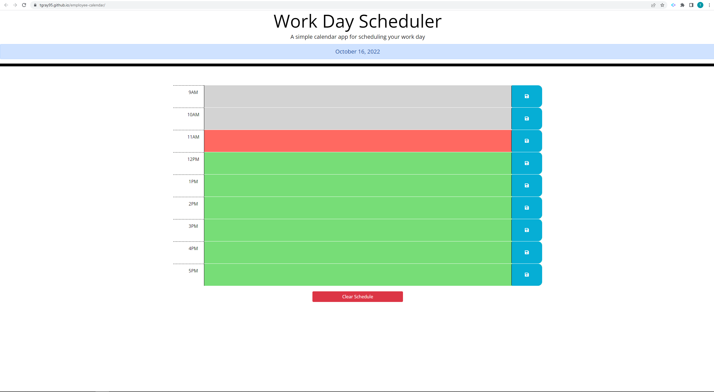

# Employee Scheduler

## Description

This application is designed to help the user schedule their workload and responsibilites throughout the workday. It allows the user to save hourly events to local storgage, and marks each hour as either past (grey), present (red), or future (green). Because events are saved locally, refreshing the webpage does not erase saved events.

## Usage

Application is located at https://tgray95.github.io/employee-calendar/. To save an event, type the description into the text area in the corresponding hour and click the save icon to the right of the text area. To clear all saved events, click the 'clear schedule' button located beneath the scheduler.

## Application Screenshot

